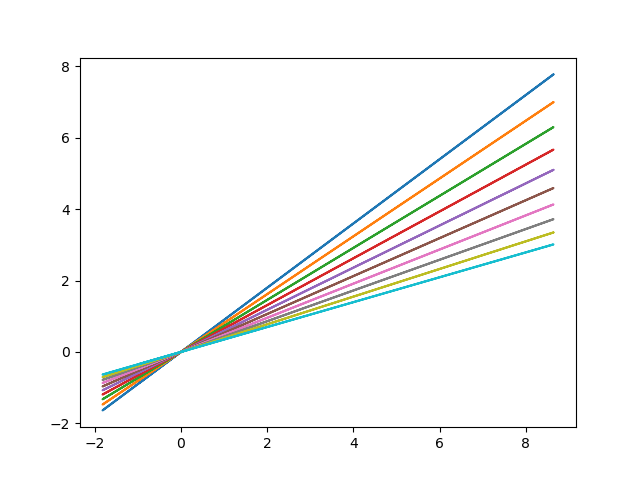

Actividad práctica:
-------------------

### Regresión de una variable:
Considere el escenario de predecir el valor de una casa dependiendo del área. Adquiera o genere un dataset que represente el problema. Tomando como base la regresión lineal, se tiene que el valor de una casa es una función del área
```
y = A0 + A1*x
```
Donde y es el valor predicho y x es el área en metros cuadrados, el modelo lineal tiene los parámetros A0 y A1, el problema de Machine learning es encontrar los valores de los parámetros A0 y A1 que adapten el modelo a los datos.


      
En Machine Learning el método mas comúnmente aplicado para estimar los parámetros de un modelo es el gradiente descendente, para ello se requiere diseñar una función de costo.

* Plantee la función de costo para el problema mencionado

La función de costo planteada para la regresión lineal es el error cuadrado medio (Mean Squared Errror) definida de esta manera:
```
def mse(a, b):
    return np.sum(np.square(b - a))/a.shape[0]
```
Consiste en promediar el valor de las (diferencias entre valor real y valor esperado) al cuadrado.  


* Aplique el gradiente descendente para encontrar los parámetros del modelo. Considere hacer normalización de los datos.

Inicialmente probaremos el resultado de aplicar el descenso de gradiente en los datos sin ajustar.

```

Starting weights: [1000.  500.] # Set arbitrarily
Starting MSE: 2819766538489.7344
Final weights: [266.77621149 492.15685172]
Final MSE: 77222387560.08604

```


A continuación analizamos las diferencias al hacer el ejercicio usando los datos normalizados
```

[[-0.9538797  -0.82020463]
 [ 0.55104357 -0.00353432]
 [-1.39777793 -0.92845673]
 ...
 [-0.52080825 -0.79023508]
 [-0.89974577 -0.36006866]
 [ 0.15045248  0.01971792]]
Scaled starting MSE: 9999.999999999987
it: 0 	rme: 9999.999999999987
gradient: [-1.00000500e+04 -5.00001988e-02]
it: 1 	rme: 9049.995500063183
gradient: [-9.00004500e+03 -4.49990694e-02]
it: 2 	rme: 8280.492305064177
gradient: [-8.10004050e+03 -4.04988896e-02]
it: 3 	rme: 7657.195122197993
gradient: [-7.29003645e+03 -3.64509106e-02]
it: 4 	rme: 7152.324768523782
gradient: [-6.56103281e+03 -3.28046553e-02]
it: 5 	rme: 6743.380110074476
gradient: [-5.90492952e+03 -2.95246537e-02]
it: 6 	rme: 6412.135231995167
gradient: [-5.31443657e+03 -2.65726158e-02]
it: 7 	rme: 6143.82714641914
gradient: [-4.78299291e+03 -2.39142537e-02]
it: 8 	rme: 5926.497836389698
gradient: [-4.30469362e+03 -2.15233740e-02]
it: 9 	rme: 5750.461310368259
gradient: [-3.87422426e+03 -1.93720552e-02]
```



