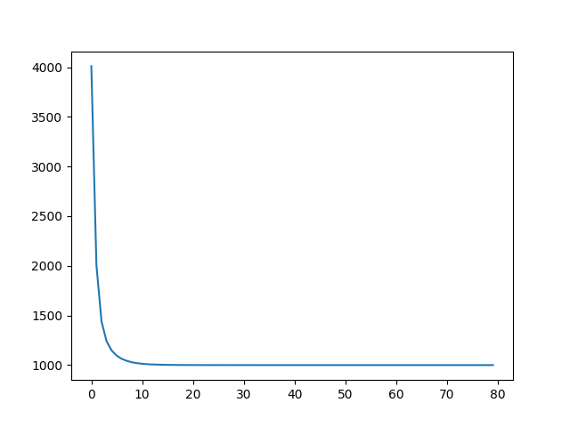

### Regresión multivariable:
Considere ahora que existe más de una característica para predecir el valor de la casa, ej. área, numero de habitaciones, años de construcción, etc. Así el modelo se convierte en:
```
y = A0 + A1 X1 + A2 X2 + ... + AnX
```

* ¿Cómo se plantearía la nueva función de costo teniendo en cuenta el nuevo conjunto de datos? realice la implementación
* Aplique el gradiente descendente para ajustar el modelo a los datos. Considere hacer normalicación de los datos.



